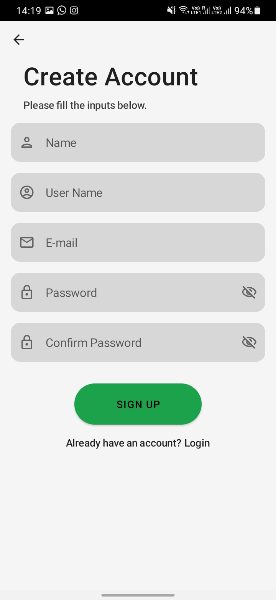
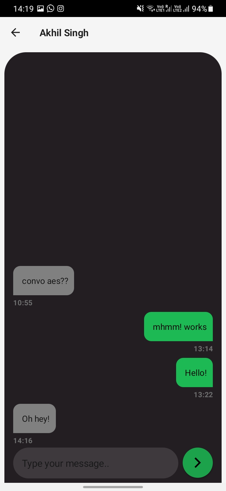
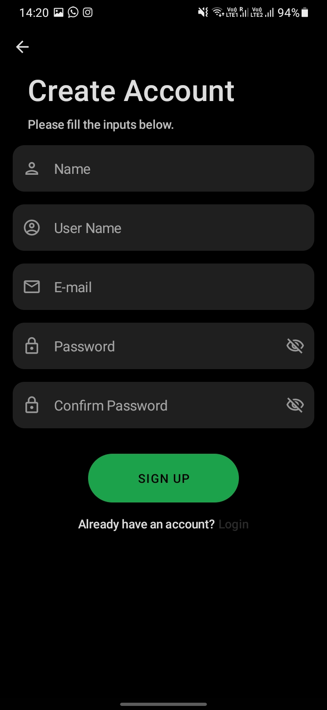
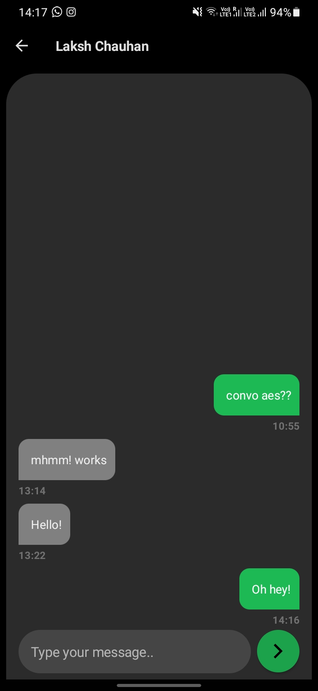

 
<h2 align="center"><b>ChAES</b></h2>
<h4 align="center">An AES encrypted app written entirely in Jetpack Compose.</h4>

<a href="#screenshots">Screenshots</a> &bull; <a href="#description">Description</a> &bull; <a href="#features">Features</a> &bull; <a href="#libraries">Libraries Used</a>

## Screenshots

### Light Theme

### Dark Theme

#### Validator

## Description
ChAES uses client side AES encryption for secure messaging. 
The app uses Firebase for database and authentication and the new UI toolkit Jetpack Compose for UI.

### Features
* User authentication
* Search usernames to send them a text
* AES encryption
* Dependency Injection
* Light and Dark Theme
* Input validator
* Unread message count

### Libraries
* [Jetpack Compose](https://developer.android.com/jetpack/compose) - UI
* [Navigation Compose](https://developer.android.com/jetpack/compose/navigation)- Navigation
* [Firebase-Auth](https://firebase.google.com/docs/auth) - Authentication
* [Firestore](https://firebase.google.com/docs/firestore) - Database
* [Preferences Datastore](https://developer.android.com/topic/libraries/architecture/datastore) - Persistent data
* [Dagger-Hilt](https://developer.android.com/training/dependency-injection/hilt-android) - Dependency Injection

### Project Setup
As this project uses Firebase for database and authentication, to set it up on your own system, you'll need to configure the project to your own firebase account.  
You can follow [this guide](https://firebase.google.com/docs/android/setup) to setup your firebase account.  
Once you download the **google-services.json** file, just replace the one in the project with that file.

